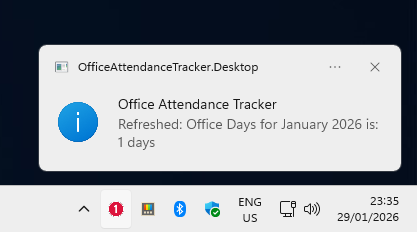
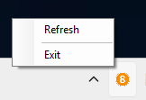
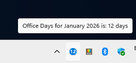

# Office Attendance Tracker

[](https://github.com/khchanel/office-attendance-tracker/actions/workflows/dotnet.yml)
[](https://github.com/khchanel/office-attendance-tracker/actions/workflows/go-attendance.yml)

Automatically detect and tracks your office attendance and monitor compliance status using Windows tray app or background service.

## Features
- Automatic detection of office presence based on configured network CIDR ranges
- Configurable
- Currently support file-based storage in CSV or JSON format.
- Lightweight with minimal resource usage
- Easy deployment as Windows Service or Desktop App
- Did I mention its fully automatic? - no manual check-in/out needed!

## Deployment Options

Two deployment modes are available:

1. **Windows Service** (`OfficeAttendanceTracker.Service`) - Runs as a background service with no UI
2. **Desktop App** (`OfficeAttendanceTracker.Desktop`) - System tray application with visual feedback

## Prerequisites
* .NET 8 SDK
* Windows OS
* Administrator privileges (for Windows Service installation)

---

## Build

Build all projects:
```
dotnet build
```

Publish a specific project:
```
dotnet publish OfficeAttendanceTracker.Service -c Release -o ./publish/service
dotnet publish OfficeAttendanceTracker.Desktop -c Release -o ./publish/desktop
```

---

## Configuration

Edit `appsettings.json` in the respective project directory:

```json
{
  "Networks": ["10.8.1.0/24", "10.1.0.0/16"],
  "PollIntervalMs": 1800000,
  "DataFilePath": null,
  "DataFileName": "attendance.csv"
}
```

**Configuration Options:**
- `Networks`: Office network CIDR ranges used to detect office presence (observe your computer network IP while in office network)
- `PollIntervalMs`: Network check interval in milliseconds (default: 30 minutes)
- `DataFilePath`: Storage path for attendance data (null = application directory) e.g. "D:\\attendance"
- `DataFileName`: Name of attendance file (supports .csv or .json)

---

## Running the Application

### Option 1: Windows Service (Background)

**Install:**
```
sc create "OfficeAttendanceTracker" binPath= "C:\path\to\publish\service\OfficeAttendanceTracker.Service.exe"
```

**Start:**
```
sc start "OfficeAttendanceTracker"
```

**Stop:**
```
sc stop "OfficeAttendanceTracker"
```

**Uninstall:**
```
sc delete "OfficeAttendanceTracker"
```

### Option 2: Desktop System Tray App

Run the executable:
```
.\publish\desktop\OfficeAttendanceTracker.Desktop.exe
```

Or during development:
```
dotnet run --project OfficeAttendanceTracker.Desktop
```

The app will start in the system tray showing current month's attendance count.

#### Desktop UI

The system tray app automatically track attendance and provides intuitive visual feedback for your office attendance:







---

## Development

Run as console app for testing:
```
dotnet run --project OfficeAttendanceTracker.Service
```
