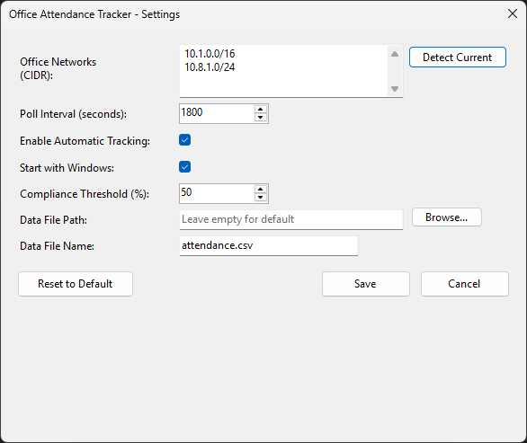

# Office Attendance Tracker

[](https://github.com/khchanel/office-attendance-tracker/releases)
[](https://github.com/khchanel/office-attendance-tracker/actions/workflows/dotnet.yml)
[](https://github.com/khchanel/office-attendance-tracker/actions/workflows/go-attendance.yml)
[](https://github.com/khchanel/office-attendance-tracker/actions/workflows/json2csv.yml)

Automatically track your office attendance by detecting your presence on configured office networks. No manual check-in required!

## Features

- **Automatic Office Detection and Tracking** - Automatically detects if you're on office networks
- **No Manual Check-In** - Attendance is recorded silently in the background
- **Two Deployment Modes** - Windows Service (background) or Desktop App (system tray)
- **Visual Feedback** - Color-coded compliance status in system tray
- **Minimal Resource Usage** - Lightweight and efficient


## Screenshots

<details>
<summary>Desktop UI [click to expand]</summary>

**System Tray Icon:**


**Settings Dialog:**


</details>


## Building from Source

```bash
# Build all projects
dotnet build

# Publish Desktop
dotnet publish OfficeAttendanceTracker.Desktop -c Release -o ./publish/desktop

# Publish Service
dotnet publish OfficeAttendanceTracker.Service -c Release -o ./publish/service
```


## Quick Start

### Prerequisites
- .NET 8 Runtime
- Windows OS
- Unix-like OS (Service mode only)

### Desktop App (Recommended)

1. Download and run `OfficeAttendanceTracker.Desktop.exe`
2. Configure office networks via Settings dialog (right-click tray icon)
3. Click "Detect Current" to auto-detect your network, or enter manually in CIDR format

### Windows Service

1. Install: `sc create "OfficeAttendanceTracker" binPath= "path\to\OfficeAttendanceTracker.Service.exe"`
2. Edit `appsettings.json` to configure networks
3. Start: `sc start "OfficeAttendanceTracker"`

## Configuration

### Desktop App
- Managed through UI (right-click tray icon → Settings)
- Settings stored in `user-settings.json` in application folder
- Data saved to `%USERPROFILE%\attendance.csv` by default

### Windows Service
- Edit `appsettings.json` manually
- Configure networks, poll interval, and compliance threshold
- Restart service after changes

**Example Configuration:**
```json
{
  "Networks": ["10.8.1.0/24", "192.168.1.0/24"],
  "PollIntervalMs": 1800000,
  "ComplianceThreshold": 0.5
}
```

## How It Works

1. Monitors your network connection at configured intervals
2. Checks if you're on an office network (via CIDR matching)
3. Records attendance if detected on office network
4. Provides visual feedback (Desktop) or logs silently (Service)

## FAQ

**Q: How is attendance calculated?**  
A: One attendance day per calendar day when detected on office network.

**Q: Can I use multiple office locations?**  
A: Yes, configure multiple network ranges.

**Q: Where is data stored?**  
A: Desktop: User profile directory. Service: Application directory. Both customizable.

**Q: What's the difference between Desktop and Service?**  
A: Desktop has GUI and runs per-user. Service runs system-wide in background.

## Contributing

Contributions welcome! See issues for planned features and improvements.

## License

This project is licensed under the MIT License - see the [LICENSE](LICENSE) file for details.

